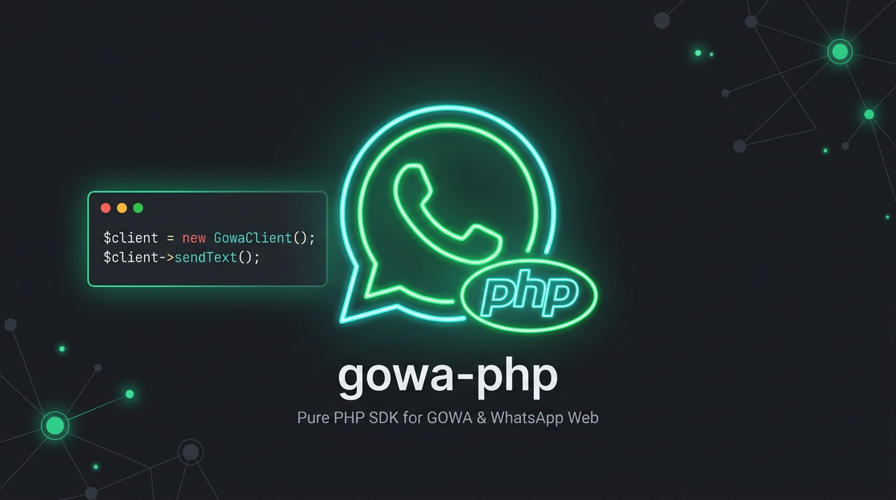

<div align="center">
  

  # gowa-php

  **SDK em PHP puro para o servidor REST GOWA (go-whatsapp-web-multidevice), alimentado pelo motor whatsmeow**

  [](https://packagist.org/packages/aguinaldotupy/gowa-php)
  [](https://packagist.org/packages/aguinaldotupy/gowa-php)
  [](LICENSE)
  [](https://php.net)

</div>

---

> 🇺🇸 For English documentation, see [README.md](README.md).

---

## ⚡ Agradecimentos e Dependências

Este SDK interage com o ecossistema backend em Go criado pela comunidade open-source:

- **[whatsmeow](https://go.mau.fi/whatsmeow)** — Biblioteca Go criada por [Tulir Asokan](https://github.com/tulir) que faz a engenharia reversa do protocolo WebSocket do WhatsApp Web Multi-Device e criptografia Signal.
- **[go-whatsapp-web-multidevice (GOWA)](https://github.com/aldinokemal/go-whatsapp-web-multidevice)** — O servidor API REST criado por [Aldino Kemal](https://github.com/aldinokemal) que expõe o `whatsmeow` via HTTP e Webhooks.

---

## Instalação

```bash
composer require aguinaldotupy/gowa-php
```

## Requisitos

- PHP >= 8.2
- Extensão `json` e `hash`
- Cliente HTTP compatível com PSR-18 ou Guzzle Client

## Exemplo de Uso

### 1. Inicializar as Configurações e o Cliente

```php
use Gowa\Sdk\Config;
use Gowa\Sdk\GowaClient;

$config = new Config(
    baseUrl: 'https://gowa.suaempresa.com',
    username: 'admin',
    password: 'secretpassword',
    timeout: 15
);

$client = new GowaClient($config);
```

### 2. Pareamento de Aparelho (QR Code ou Código de 8 Dígitos)

```php
// Criar ou registrar o dispositivo e webhook
$device = $client->createDevice(
    deviceId: 'minha-instancia-uuid',
    webhookUrl: 'https://minhaapi.com/webhooks/gowa/minha-instancia-uuid',
    webhookSecret: 'minha_chave_hmac_48_chars',
    events: ['message', 'message.ack', 'message.reaction', 'message.edited', 'message.revoked']
);

// Iniciar pareamento por QR Code
$pairing = $client->startQrPairing('minha-instancia-uuid');
echo $pairing->qrLink; // URL do QR Code

// Ou pedir código de 8 dígitos para digitar no celular
$codePairing = $client->startCodePairing('minha-instancia-uuid', '5511999998888');
echo $codePairing->pairCode; // Ex: ABCD-1234
```

### 3. Envio de Mensagens e Mídias

#### Texto, Links e Enquetes
```php
// Enviar texto
$client->sendText('minha-instancia-uuid', '5511999998888', 'Olá! Mensagem enviada via gowa-php SDK.');

// Enviar link com prévia visual
$client->sendLink('minha-instancia-uuid', '5511999998888', 'https://fazz.ai', 'Confira nosso site');

// Enviar enquete interativa
$client->sendPoll('minha-instancia-uuid', '5511999998888', 'Qual seu horário preferido?', ['Manhã', 'Tarde', 'Noite']);
```

#### Upload de Mídias (Arquivos, URLs, Streams e Notas de Voz)
```php
use Gowa\Sdk\Dto\MediaType;
use Gowa\Sdk\Dto\MediaUpload;
use Gowa\Sdk\Dto\MediaPayload;

// Enviar recado de voz (PTT) a partir de URL externa
$upload = MediaUpload::fromUrl('https://minhaempresa.com/storage/recado.m4a');
$media = new MediaPayload(type: MediaType::Audio, upload: $upload, voice: true);
$client->sendMedia('minha-instancia-uuid', '5511999998888', $media);

// Enviar documento local
$docUpload = MediaUpload::fromPath('/caminho/para/fatura.pdf');
$docMedia = new MediaPayload(type: MediaType::Document, upload: $docUpload);
$client->sendMedia('minha-instancia-uuid', '5511999998888', $docMedia);
```

#### Ações em Mensagens (Encaminhar, Editar, Revogar, Reagir, Favoritar)
```php
// Encaminhar mensagem
$client->forwardMessage('minha-instancia-uuid', '5511999998888', 'WAMID_ORIGINAL_123');

// Editar mensagem enviada
$client->editMessage('minha-instancia-uuid', '5511999998888', 'WAMID_ORIGINAL_123', 'Texto atualizado');

// Enviar reação de emoji
$client->sendReaction('minha-instancia-uuid', '5511999998888', 'WAMID_ORIGINAL_123', '👍');

// Revogar (Apagar para todos)
$client->revokeMessage('minha-instancia-uuid', '5511999998888', 'WAMID_ORIGINAL_123');

// Favoritar ou desfavoritar mensagem
$client->starMessage('minha-instancia-uuid', '5511999998888', 'WAMID_ORIGINAL_123', true);
```

### 4. Validação de Webhooks & Parse de Eventos

```php
use Gowa\Sdk\Security\WebhookSignature;
use Gowa\Sdk\Webhook\WebhookParser;
use Gowa\Sdk\Webhook\Event;
use Gowa\Sdk\Webhook\Dto\IncomingMessage;
use Gowa\Sdk\Webhook\Dto\IncomingAck;

$payload = file_get_contents('php://input');
$signature = $_SERVER['HTTP_X_HUB_SIGNATURE_256'] ?? '';
$secret = 'minha_chave_hmac_48_chars';

// 1. Validar assinatura HMAC SHA-256
if (!WebhookSignature::verify($payload, $signature, $secret)) {
    http_response_code(401);
    exit('Assinatura inválida');
}

// 2. Converter payload do webhook em DTOs fortemente tipados
$parsed = WebhookParser::parse($payload);

match ($parsed['event']) {
    Event::Message => /** @var IncomingMessage $msg */ $msg = $parsed['data'],
    Event::MessageAck => /** @var IncomingAck $ack */ $ack = $parsed['data'],
    default => null,
};
```

## Resumo dos Recursos Disponíveis

| Recurso | Método | Endpoint |
|---|---|---|
| Mensagem de Texto | `sendText()` | `POST /send/message` |
| Imagem | `sendMedia()` | `POST /send/image` |
| Vídeo | `sendMedia()` | `POST /send/video` |
| Áudio / Recado de Voz PTT | `sendMedia()` (voice: true) | `POST /send/audio` |
| Documento / Arquivo | `sendMedia()` | `POST /send/file` |
| Figurinha WebP | `sendSticker()` | `POST /send/sticker` |
| Localização | `sendLocation()` | `POST /send/location` |
| Cartão de Contato | `sendContacts()` | `POST /send/contact` |
| Prévia de Link | `sendLink()` | `POST /send/link` |
| Enquete Interativa | `sendPoll()` | `POST /send/poll` |
| Reação com Emoji | `sendReaction()` | `POST /message/:id/reaction` |
| Encaminhar Mensagem | `forwardMessage()` | `POST /message/:id/forward` |
| Editar Mensagem | `editMessage()` | `POST /message/:id/update` |
| Revogar (Apagar para todos) | `revokeMessage()` | `POST /message/:id/revoke` |
| Deletar (Local) | `deleteMessage()` | `POST /message/:id/delete` |
| Favoritar Mensagem | `starMessage()` | `POST /message/:id/star` |
| Marcar Áudio Ouvido | `markPlayed()` | `POST /message/:id/played` |
| Confirmar Leitura / Digitando | `markRead()` | `POST /message/:id/read` |

## Executando os Testes (Pest PHP)

```bash
vendor/bin/pest
```

## ⚠️ Isenção de Responsabilidade e Termos de Uso (Disclaimer)

Este software é uma biblioteca open-source desenvolvida para fins **educacionais, de pesquisa e laboratório de testes**.

- **Termos de Serviço de Terceiros**: Os usuários desta biblioteca são inteiramente responsáveis pelo cumprimento dos Termos de Serviço do WhatsApp, das Políticas da Plataforma Meta e dos termos de uso de quaisquer serviços de terceiros utilizados.
- **Envio Automatizado e Privacidade**: O envio automatizado ou não autorizado de mensagens pode violar os termos das plataformas. Cabe aos usuários garantir conformidade estrita com as leis de privacidade aplicáveis (ex: LGPD, GDPR), consentimento prévio dos destinatários e diretrizes das ferramentas.
- **Ausência de Garantias e Responsabilidade**: Este software é fornecido "como está" (*as is*), sem garantias de qualquer tipo, expressas ou implícitas. Os autores e contribuidores não se responsabilizam por eventuais bloqueios de números, banimentos de contas, perda de dados ou mau uso desta biblioteca.

## Licença

Este pacote é um software open-source licenciado sob a [Licença MIT](LICENSE).
